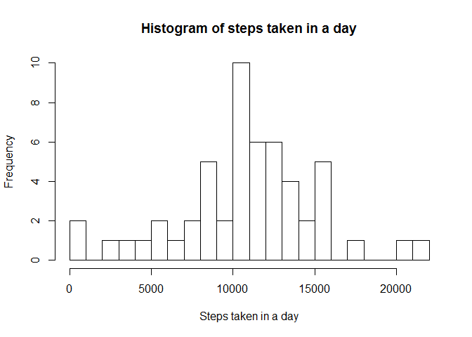
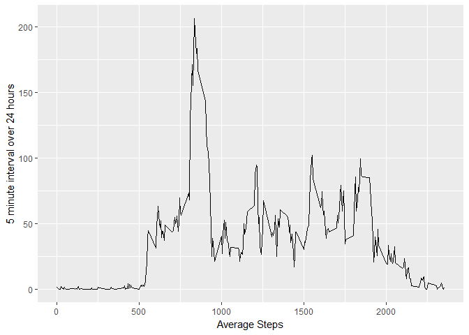
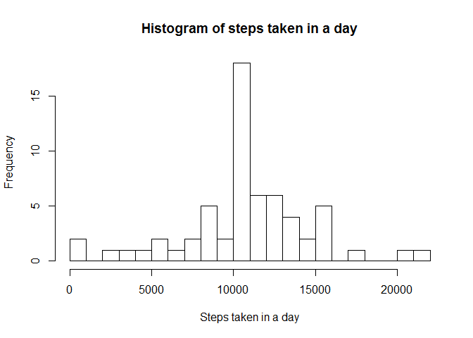
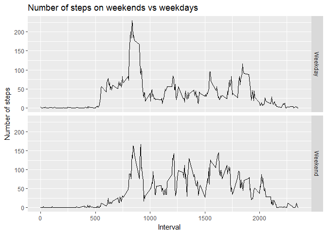

Steps Activity Report
=====================

    library(ggplot2)
    library(xtable)

    ## Warning: package 'xtable' was built under R version 3.3.3

    act <- read.csv("activity.csv")

### Calculate the total number of steps taken per day

    cAct <- act[complete.cases(act),]
    agg<-aggregate(cAct$steps, by=list(days=cAct$date), FUN=sum)
    hist(agg$x, main="Histogram of steps taken in a day", xlab = "Steps taken in a day", breaks = 20)

Calculate and report the mean and median of the total number of steps
taken per day

    meanAgg<-mean(agg$x)
    medianAgg<-median(agg$x)

    meanAgg<-formatC(meanAgg, digits = 1, format = "f")

The Mean is 10766.2 and median is 10765

What is the average daily activity pattern?
-------------------------------------------

    agg<-aggregate(cAct$steps, by=list(interval=cAct$interval), FUN=mean)
    ggplot(agg, aes(interval, x)) + geom_line() + xlab("Average Steps") + ylab("5 minute interval over 24 hours")

### Which 5-minute interval, on average across all the days in the dataset, contains the maximum number of steps?

    agg[which.max(agg$x),1]

    ## [1] 835

Imputing missing values
-----------------------

### Calculate and report the total number of missing values in the dataset (i.e. the total number of rows with NAs)

    missing <- nrow(act) - nrow(cAct)

There are 2304 rows missing information

### Devise a strategy for filling in all of the missing values in the dataset. The strategy does not need to be sophisticated. For example, you could use the mean/median for that day, or the mean for that 5-minute interval, etc.

### Create a new dataset that is equal to the original dataset but with the missing data filled in.

### Make a histogram of the total number of steps taken each day and Calculate and report the mean and median total number of steps taken per day. Do these values differ from the estimates from the first part of the assignment? What is the impact of imputing missing data on the estimates of the total daily number of steps?

    bad<- which(is.na(act$steps))
    # These are dupes, I just want to look at them here and be sure I know what I'm looking at
    cAct <- act[complete.cases(act),]
    agg<-aggregate(cAct$steps, by=list(interval=cAct$interval), FUN=mean)
    for(i in bad){
      
      row<- act[i,]
      avg<-agg[which(agg$interval==row$interval),]$x
      act$steps[i]<-avg
    }

    agg<-aggregate(act$steps, by=list(days=act$date), FUN=sum)
    hist(agg$x, main="Histogram of steps taken in a day", xlab = "Steps taken in a day", breaks = 20)

    meanAgg<-mean(agg$x)
    medianAgg<-median(agg$x)

    meanAgg<-formatC(meanAgg, digits = 1, format = "f")
    medianAgg<-formatC(medianAgg, digits = 1, format = "f")

The Mean is 10766.2 and median is 10766.2

Are there differences in activity patterns between weekdays and weekends?
-------------------------------------------------------------------------

### For this part the weekdays() function may be of some help here. Use the dataset with the filled-in missing values for this part.

### Create a new factor variable in the dataset with two levels - "weekday" and "weekend" indicating whether a given date is a weekday or weekend day

    act$day <- weekdays(as.Date(act$date))

    ## Warning in strptime(xx, f <- "%Y-%m-%d", tz = "GMT"): unable to identify current timezone 'C':
    ## please set environment variable 'TZ'

    head(act$day)

    ## [1] "Monday" "Monday" "Monday" "Monday" "Monday" "Monday"

    act$day[act$day == "Monday"] <- "Weekday"
    act$day[act$day == "Tuesday"] <- "Weekday"
    act$day[act$day == "Wednesday"] <- "Weekday"
    act$day[act$day == "Thursday"] <- "Weekday"
    act$day[act$day == "Friday"] <- "Weekday"

    act$day[act$day == "Saturday"] <- "Weekend"
    act$day[act$day == "Sunday"] <- "Weekend"

    act <- transform(act, day = factor(day))

### Make a panel plot containing a time series plot (i.e. type = "l") of the 5-minute interval (x-axis) and the average number of steps taken, averaged across all weekday days or weekend days (y-axis). The plot should look something like the following, which was created using simulated data:

    agg <- aggregate(steps ~ interval + day, data=act, mean)

    ggplot(agg, aes(x=interval, y=steps)) +
    geom_line() +
    facet_grid(day~.) +
    xlab("Interval") + ylab("Number of steps") +
    ggtitle("Number of steps on weekends vs weekdays") 

